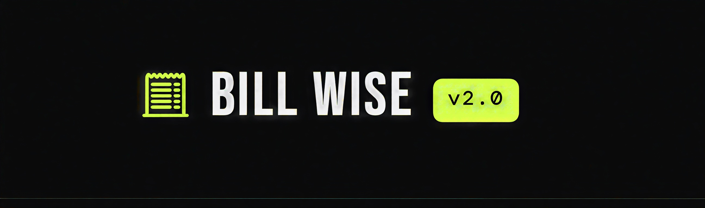
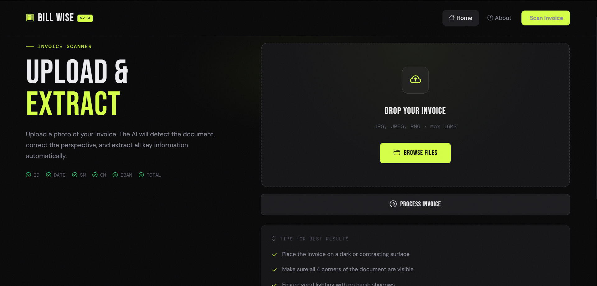
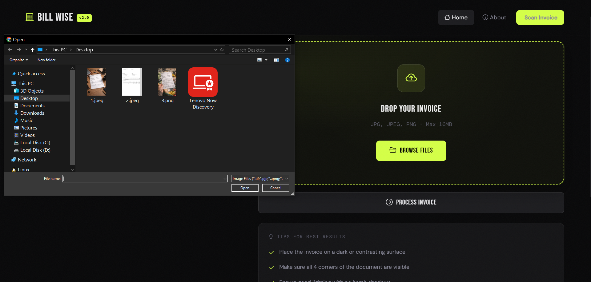
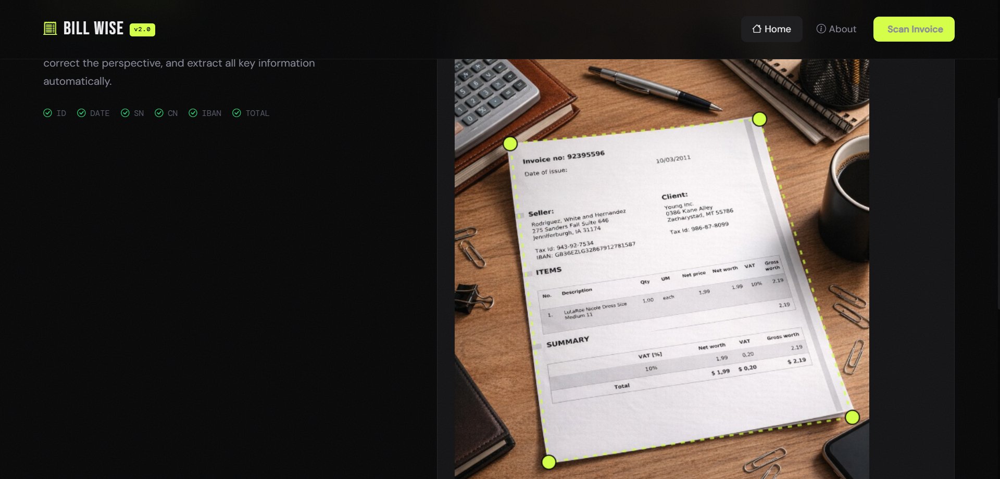
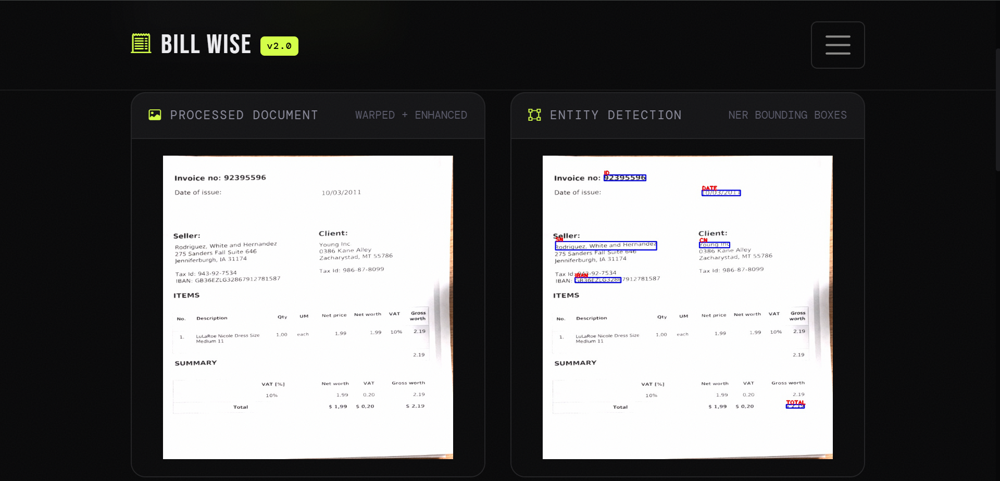
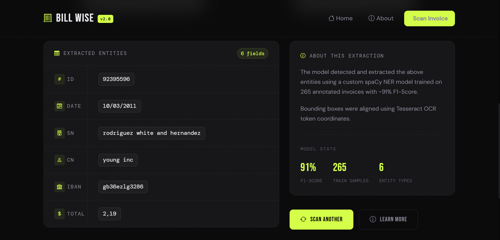

<p align="center">
  
</p>

<h1 align="center">⚡ Bill Wise Web — AI Invoice Information Extractor</h1>

<p align="center">
  <a href="https://www.python.org/"></a>
  <a href="https://flask.palletsprojects.com/"></a>
  <a href="https://getbootstrap.com/"></a>
  <a href="https://spacy.io/"></a>
  <a href="https://github.com/tesseract-ocr/tesseract"></a>
  <a href="https://opencv.org/"></a>
  <a href="https://www.microsoft.com/windows"></a>
  <a href="LICENSE"></a>
</p>

<p align="center">
  <b>Bill Wise Web</b> is a dynamic, full-stack AI-powered web application that automatically extracts structured information from invoice images. Upload a photo taken with your phone — the app detects the document, corrects the perspective, runs OCR, and uses a custom-trained NER model to identify and label all key fields.
</p>

---

## 🧬 Based On

This project is the **web application** built on top of the original research and model training work done in:

> 🔗 **[Bill-Wise V2.0](https://github.com/Younes-Barkat/Bill-Wise-V2.0)** — The core AI system behind Bill Wise Web.

Bill-Wise V2.0 contains the full NER model training pipeline: data preprocessing, spaCy configuration, training notebooks, and the document scanning algorithm. It supports both **flat scan images** (Version 1) and **real phone photos** (Version 2). The web app presented here takes the trained `model-best` checkpoint from Version 2 and wraps it in a Flask interface, making the AI accessible directly from a browser with a modern dark-mode UI.

---

## 🎯 What It Extracts

| Label | Description | Example |
|-------|-------------|---------|
| `ID` | Invoice number | `92395596` |
| `DATE` | Date of issue | `10/03/2011` |
| `SN` | Seller name | `Rodriguez, White and Hernandez` |
| `CN` | Client name | `Young Inc` |
| `IBAN` | Seller bank IBAN | `GB36EZLG32867912781587` |
| `TOTAL` | Grand total amount | `2.19` |

---

## 🖥️ Interface & Screenshots

### 🏠 Home — Upload Page
> A clean dark-mode upload interface with drag-and-drop support, file browser, and tips for best results.

<p align="center">
  
</p>

---

### 📂 File Browser
> Click "Browse Files" to open the system file picker and select your invoice image.

<p align="center">
  
</p>

---

### 🔲 Document Detection & Corner Adjustment
> After upload, the app detects the 4 corners of the invoice and renders them as draggable points on a canvas. You can fine-tune the selection before extracting.

<p align="center">
  
</p>

---

### 📄 Processed Document + NER Bounding Boxes
> The document is perspective-warped and enhanced. The NER model draws blue bounding boxes around each detected entity.

<p align="center">
  
</p>

---

### 📊 Extracted Entities Table
> All detected fields are displayed in a clean results table alongside model stats.

<p align="center">
  
</p>

---

## ⚙️ How It Works

```
📸 Phone photo
      │
      ▼
┌─────────────────────────────────────────┐
│           bill_scanner()                │
│  1. Resize image to width=590px         │
│  2. BGR → HSV, white mask               │
│     inRange([0,0,170], [180,50,255])    │
│  3. Morphological Close + Open          │
│  4. findContours → convexHull           │
│     → approxPolyDP (4 corner points)    │
│  5. four_point_transform() (imutils)    │
│  6. brightness/contrast enhancement     │
└─────────────────────────────────────────┘
      │
      ▼  🖱️ User drags corners to adjust
      │
      ▼
┌─────────────────────────────────────────┐
│           get_predictions()             │
│  1. pytesseract.image_to_data()         │
│     → DataFrame with bounding boxes     │
│  2. cleanText() — strip punctuation     │
│  3. Join tokens → model_ner(content)    │
│  4. doc.to_json() → merge NER labels    │
│     onto Tesseract bounding box data    │
│  5. group_gen() — group consecutive     │
│     same-label tokens                   │
│  6. Aggregate bounding boxes per group  │
│  7. parser() — clean by label type      │
│  8. cv2.rectangle() + cv2.putText()     │
└─────────────────────────────────────────┘
      │
      ▼
🎉 Results page — annotated image + entity table
```

---

## 📁 Project Structure

```
├── Web-App/
│   ├── main.py                         # Flask routes
│   ├── predictions.py                  # OCR + NER pipeline
│   ├── utils.py                        # BillScan class (scanner + calibrate)
│   ├── settings.py                     # Path configuration
│   ├── requirements_web_app.txt
│   ├── output/
│   │   ├── model-best/                 # Best spaCy NER checkpoint (used in production)
│   │   └── model-last/                 # Last spaCy NER checkpoint
│   ├── static/
│   │   ├── js/doc_scan.js              # Canvas corner-point drag & drop logic
│   │   ├── images/DocumentOCRScan.gif  # Loading animation
│   │   └── media/                      # Runtime image storage (uploads, results)
│   └── templates/
│       ├── index.html                  # Base template (navbar, footer)
│       ├── scanner.html                # Upload + canvas adjustment page
│       ├── predictions.html            # Results page
│       └── about.html                  # About page
├── assets/
│   ├── banner.png                      # Project banner
│   ├── ss1.png → ss5.png              # Interface screenshots
├── README.md
└── .gitignore
```

---

## 🧠 Model Details

| Property | Value |
|----------|-------|
| Framework | spaCy 3.8 |
| Pipeline | `tok2vec` → `ner` |
| Encoder | MaxoutWindowEncoder (width=96, depth=4) |
| Optimizer | Adam, lr=0.001 |
| Training steps | ~3,000–3,800 |
| Train set | 265 invoices |
| Test set | 35 invoices |
| F1-Score | ~91% |
| Precision | ~91% |
| Recall | ~91% |
| Platform | CPU · Windows |

---

## 🛠️ Tech Stack

| Layer | Technology |
|-------|------------|
| 🌐 Web framework | Flask (dynamic Python backend) |
| 🎨 Frontend | Bootstrap 5.3 · Bootstrap Icons · jQuery |
| 🔤 Fonts | Bebas Neue · DM Mono · DM Sans |
| 📷 Document scanner | OpenCV · imutils |
| 🔍 OCR | Tesseract 4.1 · pytesseract |
| 🤖 NER model | spaCy 3.8 (custom trained) |
| 📊 Data processing | pandas · numpy |

---

## 🚀 Getting Started

### Prerequisites

- Python 3.11
- [Tesseract OCR](https://github.com/UB-Mannheim/tesseract/wiki) installed at `C:\Program Files\Tesseract-OCR\tesseract.exe`
- Git

### Installation

**1. Clone the repository**
```bash
git clone https://github.com/Younes-Barkat/Bill-Wise-Web.git
cd Bill-Wise-Web
```

**2. Create and activate a virtual environment**
```bash
python -m venv bill_app
bill_app\Scripts\activate
```

**3. Install dependencies**
```bash
pip install -r Web-App/requirements_web_app.txt
```

**4. Run the app**
```bash
cd Web-App
python main.py
```

**5. Open in browser**
```
http://127.0.0.1:5000
```

---

## ⚠️ Known Limitations

> **White background issue** — When the invoice is photographed against a bright or white surface, the HSV white mask captures both the document and the background, causing the 4-point contour detection to fail. The app falls back to default corner positions which you can adjust manually on the canvas. A YOLO-based object detection model is being explored as a future solution.

---

## 🤝 Contributing

Contributions are welcome and appreciated! 🎉

If you have a fix, improvement, or new feature in mind:

1. Fork the repository
2. Create a new branch: `git checkout -b feature/your-feature-name`
3. Commit your changes: `git commit -m "Add your feature"`
4. Push to the branch: `git push origin feature/your-feature-name`
5. Open a Pull Request

Feel free to open an issue for bugs, suggestions, or questions.

---

## 👨‍💻 Author

Built by **Younes Barkat**

[](https://github.com/Younes-Barkat)
[](https://linktr.ee/Younes_Barkat)

---

## 📄 License

This project is licensed under the MIT License.

---

<p align="center">
  Made with ❤️ by <a href="https://github.com/Younes-Barkat">Younes Barkat</a>
</p>
