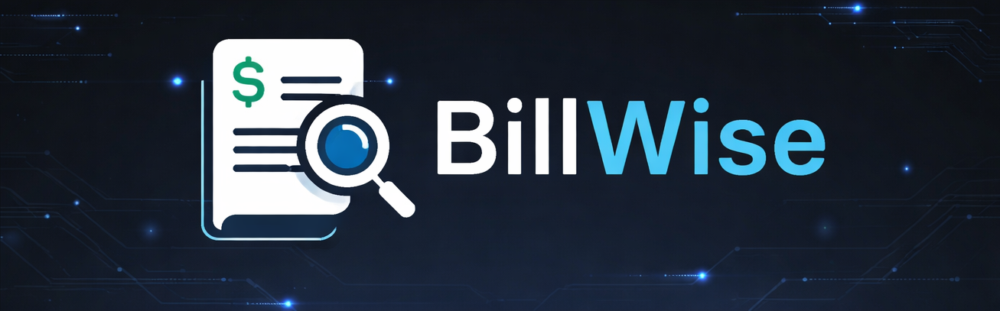
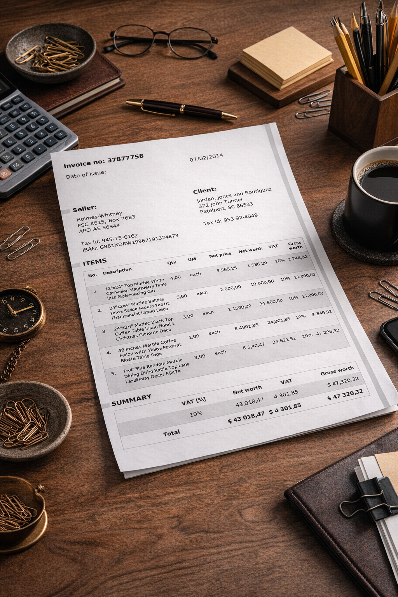
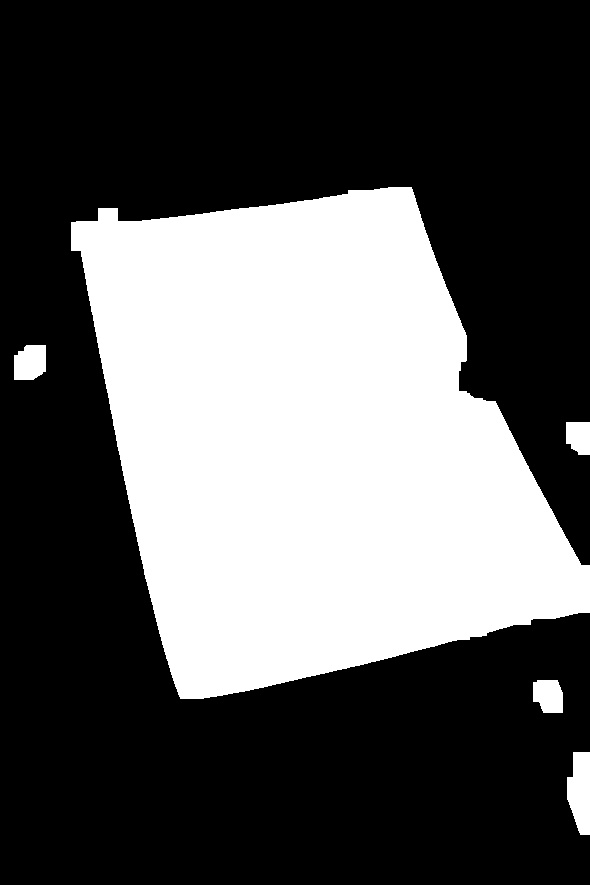
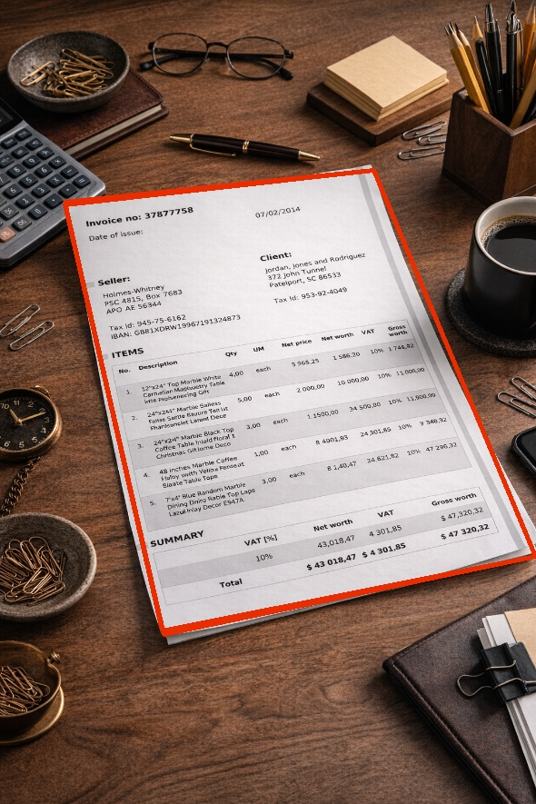
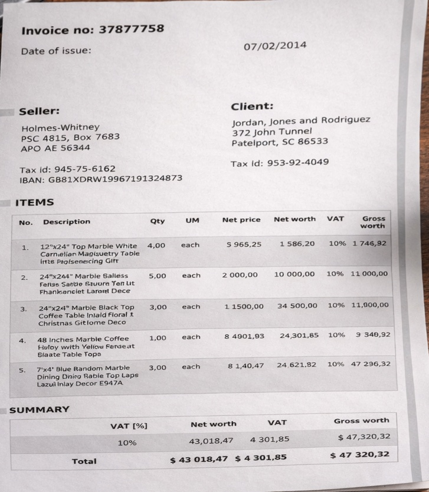
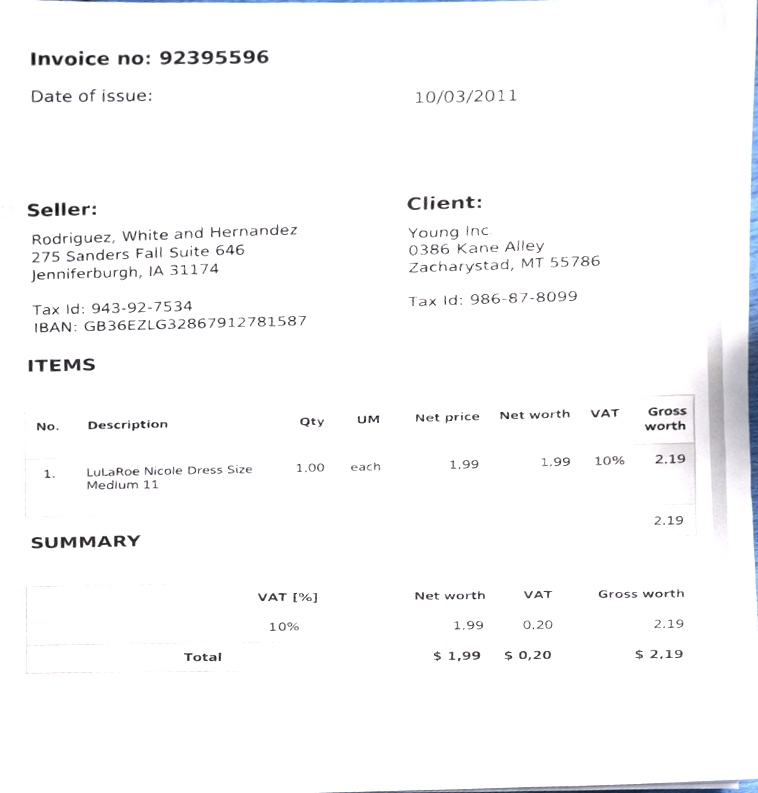
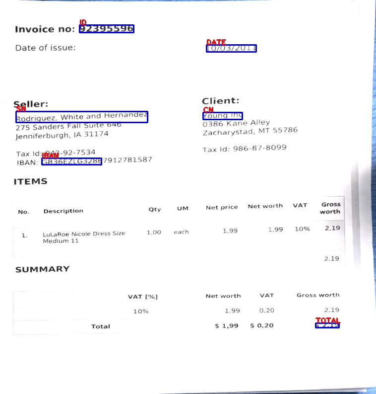

# Bill-Wise V2.0


An AI-powered Named Entity Recognition (NER) system that automatically extracts key information from invoice or bill images using OCR and a custom-trained spaCy model — works even from a photo taken with your phone 📱

---

## 🔍 Overview

Bill-Wise V2.0 processes invoice/bill images and identifies structured fields such as invoice IDs, dates, seller names, client names, IBANs, and totals — turning unstructured scanned documents into structured data.

The pipeline goes from raw invoice images → document detection → perspective correction → brightness/contrast enhancement → OCR text extraction → manual BIO labeling → spaCy model training → entity extraction.

> 🌐 **A web version of Bill-Wise is currently in development** — stay tuned!

---

## 📸 Processing Steps

The system handles real-world photos taken with a phone, not just clean scans. Here is the full processing pipeline on a real invoice photo:

| Step | Description | Preview |
|------|-------------|---------|
| 1 | Original photo taken with phone |  |
| 2 | Binary threshold mask to detect the document |  |
| 3 | Document contour detected (red border) |  |
| 4 | Perspective warp — document straightened |  |
| 5 | Clean cropped document ready for OCR |  |
| 6 | Final prediction with bounding boxes |  |

---

## 🎯 Prediction Example

The model takes an invoice image, extracts text via OCR, and highlights the named entities directly on the document:


---

## 🛠️ Resources & Tools Used

- **Invoice Dataset** — [High Quality Invoice Images for OCR](https://www.kaggle.com/datasets/osamahosamabdellatif/high-quality-invoice-images-for-ocr) (Kaggle)
- **Tesseract OCR** — [tesseract-ocr-w64-setup-v4.1.0.20190314.exe](https://digi.bib.uni-mannheim.de/tesseract/) (Uni Mannheim builds)
- **spaCy** — [spacy.io](https://spacy.io/) — NER model training framework

---

## 🏷️ Entity Labels Using BIO Labeling

| Label | Description | Example |
|-------|-------------|---------|
| `ID` | Invoice number | `51109338` |
| `DATE` | Date of issue | `04/13/2013` |
| `SN` | Seller name | `Andrews, Kirby and Valdez` |
| `CN` | Client name | `Becker Ltd` |
| `IBAN` | Seller bank IBAN | `GB75MCRL06841367619257` |
| `TOTAL` | Grand total amount | `$6,204.19` |

---

## 📁 Project Structure

```
Bill-Wise-V2.0/
├── 1_BillNER/
│   ├── Version_1/                    # First training version (flat scans)
│   │   ├── data/
│   │   │   ├── TrainData.pickle      # Training data (images 001-265)
│   │   │   ├── TestData.pickle       # Testing data (images 266-300)
│   │   │   ├── train.spacy
│   │   │   └── test.spacy
│   │   ├── output/
│   │   │   ├── model-best/           # Best checkpoint
│   │   │   └── model-last/           # Final model
│   │   ├── Data_Preprocessing.ipynb
│   │   ├── Preparation.ipynb
│   │   ├── Preparation2.ipynb
│   │   ├── final_predictions.ipynb
│   │   ├── predictions.ipynb
│   │   ├── predictions.py
│   │   ├── organizing.py
│   │   ├── preprocess.py
│   │   ├── base_config.cfg
│   │   ├── config.cfg
│   │   └── all_inovices.csv
│   └── Version_2/                    # Second version (phone photo support)
│       ├── data/
│       │   ├── TrainData.pickle
│       │   ├── TestData.pickle
│       │   ├── train.spacy
│       │   └── test.spacy
│       ├── output/
│       │   ├── model-best/
│       │   └── model-last/
│       ├── Data_Preprocessing.ipynb
│       ├── final_predictions.ipynb
│       ├── predictions.ipynb
│       ├── predictions.py
│       ├── preprocess.py
│       ├── base_config.cfg
│       └── config.cfg
├── Bill-Scanner/                     # Document scanner module
│   ├── bill_scanner_1.ipynb          # Document detection & perspective correction
│   ├── predictions.py
│   └── output/
│       ├── model-best/
│       └── model-last/
├── steps/                            # Processing step illustrations
│   ├── step1.jpeg
│   ├── step2.jpeg
│   ├── step3.jpeg
│   ├── step4.jpeg
│   ├── step5.jpeg
│   └── step6.jpeg
├── banner.png
├── predicted_example.jpeg
├── TrainingProcess.png
├── requirements.txt
├── .gitignore
└── README.md
```

---

## ⚙️ Pipeline

The system is built around two core modules: **`bill_scanner()`** for document extraction from phone photos, and **`get_predictions()`** for NER inference.

```
📱 Phone Photo of Invoice
       |
       v
┌──────────────────────────────────────────────────────────────────┐
│  bill_scanner(image)       [ Bill-Scanner/bill_scanner_1.ipynb ] │
│                                                                   │
│  1. resize_func()                                                 │
│     └── Resize to width=590px keeping aspect ratio               │
│                                                                   │
│  2. White region detection                                        │
│     └── Convert BGR → HSV                                        │
│     └── Mask white pixels: inRange(HSV, [0,0,170], [180,50,255]) │
│     └── Morphological Close + Open (20x20 kernel) to clean mask  │
│                                                                   │
│  3. Document contour detection                                    │
│     └── findContours → sort by area (largest first)              │
│     └── convexHull → approxPolyDP (tolerance = 0.02 * perimeter) │
│     └── Keep first contour with exactly 4 corners                │
│                                                                   │
│  4. four_point_transform() — imutils                              │
│     └── Scale corner points back to original resolution          │
│     └── Apply perspective warp → flat straightened document      │
│                                                                   │
│  5. bright_cont()                                                 │
│     └── Adjust brightness and/or contrast via cv2.addWeighted    │
│     └── Improves OCR accuracy on dark or low-contrast photos     │
└──────────────────────────────────────────────────────────────────┘
       |
       v
  Clean, flat, enhanced invoice image
       |
       v
┌──────────────────────────────────────────────────────────────────┐
│  get_predictions(image)                    [ predictions.py ]    │
│                                                                   │
│  1. pytesseract.image_to_data()                                   │
│     └── Extract tokens with bounding box coords                  │
│         (left, top, width, height) into a DataFrame              │
│                                                                   │
│  2. cleanText()                                                   │
│     └── Strip whitespace and punctuation from each token         │
│     └── Remove empty tokens                                      │
│                                                                   │
│  3. spaCy NER inference                                           │
│     └── Join all clean tokens into one content string            │
│     └── model_ner(content) → doc.to_json()                       │
│     └── Extract entity spans (start/end character positions)     │
│                                                                   │
│  4. Token-entity alignment                                        │
│     └── Compute character start/end for each Tesseract token     │
│     └── Merge NER labels onto the bounding box DataFrame         │
│                                                                   │
│  5. group_gen() — consecutive token grouping                      │
│     └── Group adjacent tokens sharing the same label             │
│     └── Aggregate bounding boxes:                                │
│         left=min, right=max, top=min, bottom=max                 │
│                                                                   │
│  6. parser() — entity value cleaning per label type              │
│     └── ID / TOTAL  → digits only (re.sub \D)                    │
│     └── DATE        → digits and '/' only                        │
│     └── SN / CN     → letters and ',' only                       │
│     └── IBAN        → alphanumeric only                          │
│                                                                   │
│  7. Draw results on image                                         │
│     └── cv2.rectangle() — blue bounding box per entity group     │
│     └── cv2.putText()   — red label text above each box          │
└──────────────────────────────────────────────────────────────────┘
       |
       v
  img_bb   — annotated image with bounding boxes 🖼️
  entities — { ID, DATE, SN, CN, IBAN, TOTAL } 📋
```

---

## 🚀 Getting Started

### 1. Clone the repository

```bash
git clone https://github.com/Younes-Barkat/Bill-Wise-V2.0.git
cd Bill-Wise-V2.0
```

### 2. Install Tesseract OCR

Download and install **[tesseract-ocr-w64-setup-v4.1.0.20190314.exe](https://digi.bib.uni-mannheim.de/tesseract/)** and make sure it is added to your system PATH.

### 3. Create a virtual environment and install dependencies

```bash
python -m venv venv
venv\Scripts\activate
pip install -r requirements.txt
```

### 4. Scan and straighten your invoice (phone photo)

Open and run **`Bill-Scanner/bill_scanner_1.ipynb`** — detects the document using HSV white masking and contour detection, corrects the perspective with `four_point_transform`, then enhances brightness/contrast with `bright_cont()` before passing to the NER model.

### 5. Run OCR extraction

Open and run **`Preparation2.ipynb`** — runs Tesseract OCR on the clean image and saves tokens with bounding box coordinates to `all_inovices.csv`.

### 6. Manual BIO Labeling

Each token was labeled manually using the BIO tagging scheme for all 300 invoice images. This was the most time-intensive step, taking approximately half a day to complete.

| Tag | Meaning |
|-----|---------|
| `B-<LABEL>` | Beginning of an entity |
| `I-<LABEL>` | Inside (continuation) of an entity |
| `O` | Outside — not an entity |

### 7. Prepare training data

Open and run **`Preparation.ipynb`** and **`Data_Preprocessing.ipynb`** to generate `TrainData.pickle` (images 1-265) and `TestData.pickle` (images 266-300).

### 8. Convert to spaCy format

```bash
python preprocess.py
```

### 9. Initialize and train the model

```bash
python -m spacy init fill-config ./base_config.cfg ./config.cfg

python -m spacy train ./config.cfg --output ./output/ --paths.train ./data/train.spacy --paths.dev ./data/test.spacy
```

### 10. Run predictions

Open **`final_predictions.ipynb`** — loads the trained model, calls `bill_scanner()` to flatten the photo, then `get_predictions()` to extract and visualize all entities with bounding boxes.

---

## 📊 Training Results

The model was trained on **265 annotated invoice images** and evaluated on **35 held-out images** (images 266-300), using spaCy's `tok2vec` + `ner` pipeline on CPU.

| Metric | Score |
|--------|-------|
| F1-Score (ENTS_F) | ~91% |
| Precision (ENTS_P) | ~91% |
| Recall (ENTS_R) | ~91% |
| Best overall score | 0.91 |

Training converged around 3,000-3,800 steps with `patience = 1600` and `max_steps = 20000`.


---

## 🧠 Model Architecture

- **Framework:** spaCy 3.8
- **Pipeline:** `tok2vec` -> `ner`
- **Embeddings:** `MultiHashEmbed` on NORM, PREFIX, SUFFIX, SHAPE features
- **Encoder:** `MaxoutWindowEncoder` (width=96, depth=4, window_size=1)
- **NER decoder:** `TransitionBasedParser` (hidden_width=64)
- **Optimizer:** Adam (lr=0.001, L2=0.01, dropout=0.1)

---

## ⚠️ Known Issues & Limitations

- **White background detection:** When the invoice is photographed against a very bright or white surface, the HSV white mask captures both the paper and the background simultaneously — making the 4-point contour detection fail to isolate the document correctly.

  > 💡 A possible solution being explored is replacing the threshold-based detection with a **YOLO object detection model** trained specifically to locate document boundaries regardless of background color.

- **Contributions welcome!** If you have ideas or solutions for any of the issues above, feel free to open a **pull request** 🙌

---

## 📦 Requirements

Key dependencies (see `requirements.txt` for the full list):

- Python 3.11
- spaCy 3.8
- pytesseract 0.3.13
- opencv-python 4.x
- imutils
- pandas 3.x
- numpy 2.x
- tqdm, natsort

---

## 👤 Author

**Younes Barkat** — [GitHub](https://github.com/Younes-Barkat)
